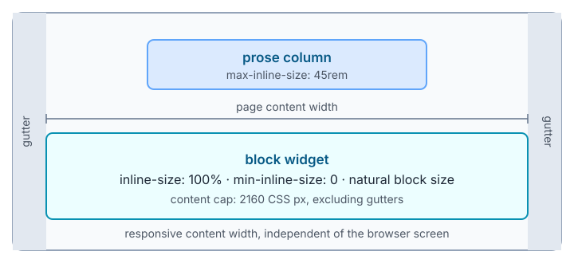
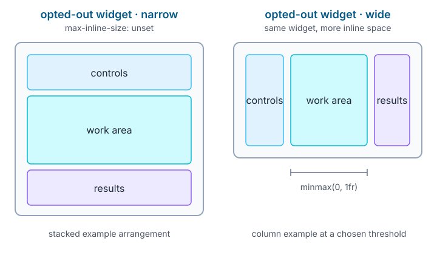

# Responsiveness

Widgets are placed in a page that can be narrower or wider than the browser window used during development. A widget must fit the inline size its parent allocates, keep its controls usable, and let its content determine its block size.



## Fit the allocated width

The parent chooses a widget's inline size through normal CSS. A block widget should fill that allocation and must not require a particular screen size. Its host should establish a predictable sizing boundary:

```css
:host {
  display: block;
  box-sizing: border-box;
  inline-size: 100%;
  min-inline-size: 0;
  max-inline-size: 100%;
  block-size: auto;
  container-type: inline-size;
}
```

This contract applies to block widgets. Inline widgets, such as an inline equation or icon, can choose their own inline formatting and should not inherit this block styling.

Keep this declaration on each block widget's host. Do not impose it with a universal selector that changes every element in the document.

Block widgets should support allocated widths from **280 CSS px through 2160 CSS px**. The 280 CSS px value is a test target, not a `min-width`. A widget must narrow gracefully below 280 CSS px as well, including in a 280 CSS px viewport where page gutters reduce the content width. Do not assume that the widget's width equals the browser viewport or a desktop monitor width.

The widget owns its internal layout and its natural height. Do not set a fixed host height to make a wide layout fit. Let text wrap and controls stack as the allocation changes.

## Set page and reading widths

The base theme provides the page sizing defaults. Its content cap is 2160 CSS px, excluding gutters. Prose is capped at 45rem, and the page gutter is responsive. The body owns the page width and gutters; adding the same padding to `main` would apply the gutters twice.

These rules belong to the `webwriter-theme` cascade layer, so authored CSS can override them:

```css
:root {
  --ww-page-max: 2160px;
  --ww-prose-max: 45rem;
  --ww-page-gutter: clamp(1rem, 2vw, 2rem);
}

body {
  inline-size: 100%;
  min-inline-size: 0;
  max-inline-size: calc(var(--ww-page-max) + 2 * var(--ww-page-gutter));
  margin: 1.25rem auto;
  padding-inline: var(--ww-page-gutter);
}

body > header,
body > main,
body > footer {
  inline-size: 100%;
  min-inline-size: 0;
  margin-inline: auto;
  padding-block: var(--pico-block-spacing-vertical);
}

:where(body, body > main, body > article, body > section)
  > :where(h1, h2, h3, h4, h5, h6, p, ul, ol, dl, blockquote) {
  max-inline-size: var(--ww-prose-max);
  margin-inline: auto;
}
```

The base theme applies border-box sizing globally. Keep a comfortable prose measure without forcing every widget into that column. A wide widget can use the page content width when its parent allocates it. Authors can also size a widget with ordinary CSS, for example `inline-size: min(100%, 60rem)`, as long as the widget remains able to shrink.

Exported documents include their theme CSS. If an existing document contains an older copy of the base theme, update that copy to use these defaults in preview and export as well.

## Respond to the container

The useful breakpoint for a widget is the width of its allocated container, not the browser screen. Give the host `container-type: inline-size`, then use [CSS container queries](https://developer.mozilla.org/en-US/docs/Web/CSS/CSS_containment/Container_queries) inside the widget's shadow DOM. This behavior is defined by the [CSS Conditional Rules Module](https://www.w3.org/TR/css-conditional-5/#container-type). Query descendants that own the layout:

```html
<div class="layout">
  <section class="controls">…</section>
  <section class="work-area">…</section>
  <section class="results">…</section>
</div>
```

```css
.layout {
  display: grid;
  grid-template-columns: minmax(0, 1fr);
  gap: 0.75rem;
  min-inline-size: 0;
}

.controls,
.work-area,
.results {
  min-inline-size: 0;
}

@container (inline-size >= 48rem) {
  .layout {
    grid-template-columns: 16rem minmax(0, 1fr);
  }

  .results {
    grid-column: 1 / -1;
  }
}

@container (inline-size >= 90rem) {
  .layout {
    grid-template-columns: 16rem minmax(0, 1fr) 16rem;
  }

  .results {
    grid-column: auto;
  }
}
```

The 48rem and 90rem values are useful examples, not required breakpoints. Choose thresholds from the space your controls and work area need. The one-column base layout keeps a narrower allocation usable without a query. Use `minmax(0, 1fr)` and `min-inline-size: 0` on grid and flex children so long labels, code, and replaced elements can shrink. At a narrow allocation, stack controls and results around the work area. At a wider allocation, give the work area the extra space.

The Lit widget starter includes the host declaration above for new widgets. Existing widgets should adopt the same host styles in their shadow-DOM stylesheet.



Use the normal font size for text and controls. Make the layout fit by wrapping, grouping, or stacking controls rather than shrinking the whole interface until it is hard to read. Give long labels room to wrap, and ensure keyboard focus remains visible in every arrangement.

## Measure only when a library needs it

Most widgets need no resize code. Use [`ResizeObserver`](https://developer.mozilla.org/en-US/docs/Web/API/ResizeObserver) only when an imperative canvas or third-party library must be told its drawing surface size. Observe the widget's internal work area, disconnect the observer when the widget is destroyed, and keep the measured size local to that rendering code.

Do not add a resize protocol, breakpoint attributes, or serialized layout state. CSS container queries and ordinary layout already respond to the current DOM and allocation. A local two-dimensional canvas may expose its own pan or scroll region when that is part of the interaction; this does not justify hiding overflow on the page or widget host.

Avoid these patterns:

```css
/* Do not turn the test target into a minimum width. */
:host { min-width: 280px; }

/* Do not clip the document to hide an overflowing layout. */
body { overflow: hidden; }

/* Do not make a fixed viewport assumption. */
.widget { width: 100vw; }
```

## Preserve the document model

Authors size widgets with ordinary CSS. Do not add editor wrappers or state attributes to authored content to make responsiveness work. The live HTML DOM remains the document state, and it must continue to support native editing, widget mutations, collaboration, and export. Editor menus, handles, and other editor UI belong in the editor's shadow appendix.

## Test allocated widths

Test the widget at allocated widths of **280, 320, 640, 960, 1440, 1920, and 2160 CSS px**, plus at least one narrower allocation. Check the rendered DOM and shadow DOM at each width, including:

- controls, labels, and results remain readable and usable;
- columns have no horizontal overflow and the work area gets the available space;
- nested widgets and nested editable content still fit their parent;
- browser zoom changes do not create a fixed-width assumption;
- native editing, preview, and export preserve the same authored DOM;
- resizing while the widget is active does not lose focus, selection, or local work.

For the editor's base-theme and widget fixture, the local test harness is available at `http://127.0.0.1:1234/tests/responsiveness.html` while the development server is running. It checks the base theme and fixture widget; published widgets still need their own test coverage. Use browser developer tools or automated viewport tests as appropriate. Include a 280 CSS px viewport with its gutters in the test matrix so the widget is exercised at an allocation narrower than the 280 CSS px target.
