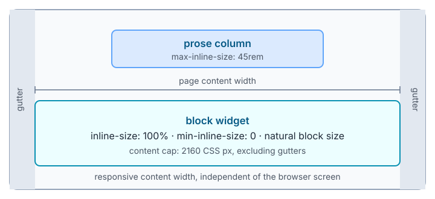
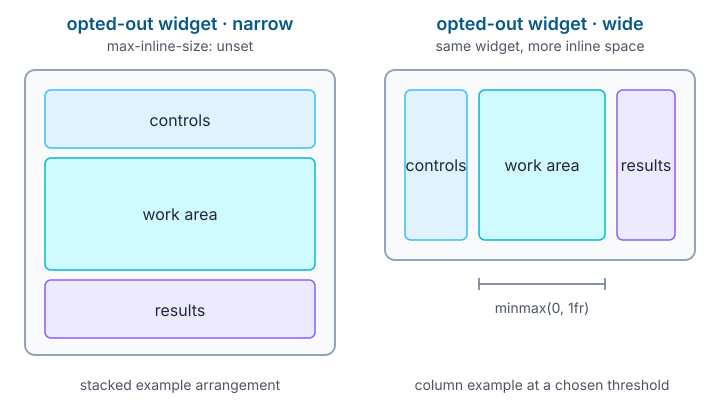

# Responsiveness

Widgets are placed in a page that can be narrower or wider than the browser window used during development. A widget must fit the inline size its parent allocates, keep its controls usable, and let its content determine its block size.



## Fit the allocated width

The parent chooses a widget's inline size through normal CSS. A block widget should fit that allocation and must not require a particular screen size. The widget's own host styles should establish a predictable sizing boundary:

```css
:host {
  display: block;
  max-inline-size: var(--ww-widget-max, var(--ww-prose-max, 45rem));
  margin-inline: auto;
  inline-size: auto;
  min-inline-size: 0;
  block-size: auto;
  box-sizing: border-box;
  container-type: inline-size;
}
```

This contract applies to block widgets. Inline widgets, such as an inline equation or icon, can choose their own inline formatting and should not inherit this block styling.

Use this declaration in each block widget's own styles so it also has a sensible default when nested. The base theme also gives ordinary block children a prose-width maximum and centers them in the page. A widget host can use `--ww-widget-max` to choose its own maximum.

Block widgets should support allocated widths from **280 CSS px through 2160 CSS px**. The 280 CSS px value is a test target, not a `min-width`. A widget must narrow gracefully below 280 CSS px as well, including in a 280 CSS px viewport where page gutters reduce the content width. Do not assume that the widget's width equals the browser viewport or a desktop monitor width.

The widget owns its internal layout and its natural height. Do not set a fixed host height to make a wide layout fit. Let text wrap and controls stack as the allocation changes.

## Set page and reading widths

The base theme provides the page sizing defaults. Its content cap is 2160 CSS px, excluding gutters. The body spans that fluid page width and owns the responsive gutters. Ordinary block children default to the prose measure, while structural `main`, `article`, and `section` elements can use the full page content width. The body itself is not the reading column; its child blocks are centered within the available page.

These rules belong to the `webwriter-theme` cascade layer, so authored CSS can override them:

```css
:root {
  --ww-page-max: 2160px;
  --ww-prose-max: 45rem;
  --ww-page-gutter: clamp(1rem, 2vw, 2rem);
}

body {
  display: flow-root;
  inline-size: auto;
  min-inline-size: 0;
  max-inline-size: calc(var(--ww-page-max) + 2 * var(--ww-page-gutter));
  margin: 1.25rem auto;
  padding-inline: var(--ww-page-gutter);
}

body > :not(main, article, section) {
  max-inline-size: var(--ww-widget-max, var(--ww-prose-max, 45rem));
  inline-size: auto;
  margin-inline: auto;
}

body > :is(main, article, section) {
  padding-inline: 0;
  max-inline-size: none;
  inline-size: auto;
  margin-inline: auto;
}

:where(body, body > main, body > article, body > section)
  > :where(h1, h2, h3, h4, h5, h6, p, ul, ol, dl, blockquote) {
  max-inline-size: var(--ww-prose-max);
  margin-inline: auto;
}
```

The base theme applies border-box sizing globally. The parent page remains fluid up to the 2160 CSS px content ceiling. Ordinary direct children and children of the structural landmarks default to a 45rem upper bound; the landmarks themselves remain wide.

Exported documents include their theme CSS. If an existing document contains an older copy of the base theme, update that copy to use these defaults in preview and export as well.

## Float beside the reading measure

The Float controls offer **Left**, **Right**, and **None**. A superscript arrow in the breadcrumb shows the authored float direction, including when responsive CSS stacks the element. Floats use
native `float` and negative outer margins, without wrappers or classes. At
viewport widths of 1200px and wider, a left or right float anywhere inside the
body reserves an equal lane on each side of the body’s central reading measure.
This keeps all body children aligned, including blocks before the float. Floated elements fill the lane by default; authored dimensions and manual resizing can make them narrower. The
reservation is based on the configured lane width plus gap. Floats are bounded
by the lane width and floats on the same side clear one another when their
vertical space overlaps. Canvas and slide scopes are excluded.

Float previews cover the projected element box, including reading content that will move after insertion. Moving elements use their live dimensions; built-in insertion templates are measured with the document styles. Unknown widgets and snippets use a lane-width 16:9 footprint until their dimensions are known. These overlays and temporary measurements stay in the editor’s shadow appendix.

Float drop zones use the same projected boxes. Releasing over a preview keeps its side and insertion point, even outside the current content column or over text that will be displaced. Drops outside these boxes use ordinary flow placement. Projected drop rectangles are prepared when a document drag starts, or when a ribbon drag first enters the editor. Hover hit testing and previews reuse those rectangles. Document changes and resize schedule a refresh; window scrolling shifts the stored coordinates without remeasurement.

From 600px to below 1200px, both float directions share a right lane and clear one another. The lane uses up to 16rem, leaving at least 300px for text. Below 600px, floats become centered blocks in a single column. Widening the viewport restores their authored left/right setting.

Paragraphs use `display: flow-root` and `min-inline-size: min(300px, 100%)`.
They move below a float when the remaining space is less than 300px, and fit
the full column when the column itself is narrower than 300px.

The default desktop lanes divide the space remaining outside the prose column equally, allowing for the float gap. They shrink as the page narrows while the center keeps its configured prose width. Below 600px, floats stack and use a 16rem default width bounded by the available content width. Set `--ww-float-width` to choose a fixed desktop lane width instead:

```css
:root {
  --ww-float-width: 16rem;
  --ww-float-gap: 1rem;
}
```

The command stores the chosen size in an authored inline
`--ww-float-size` property. It is calculated from the available width, theme lane
width and authored width, so the float cannot exceed its available side lane.
Authored maxima can narrow it further. Resize handles update the preferred float width so it can shrink or grow within the lane. The theme uses that size for the float width, then moves it
out by the matching lane reservation. Switching to None removes float placement
and command-owned sizing while retaining authored dimensions.

The shared float stylesheet is included in saved theme CSS, so the layout also
works in standalone exports without editor JavaScript. Keep the reading column
centered and avoid clipping overflow on its ancestors.

## Use more space

The default block widget matches the prose width so it aligns with surrounding reading content. Set `--ww-widget-max: none` on a widget host to let it use the available page width:

```css
body > webwriter-my-widget { --ww-widget-max: none; }
```

A widget inside a structural container can use the same opt-in. Structural containers already remain wide, so the widget only needs to remove its own maximum in its shadow-DOM stylesheet when its host styles define one:

```css
:host { --ww-widget-max: none; }
```

The theme expresses the widget maximum through `--ww-widget-max`, which defaults to the prose measure. Setting it to `none` removes that upper bound, so content can still remain smaller and respond to its allocation. A host's own styles should use `max-inline-size: var(--ww-widget-max, var(--ww-prose-max, 45rem))` to participate in the same sizing contract. Use logical properties consistently; `width` and `max-width` are the horizontal equivalents when physical properties are required.

## Resize during transformations

Transformation resizing defaults to the authored `max-inline-size` and `max-block-size` on the affected logical axes. These are upper bounds, so content can remain smaller and continue responding to its available space. Existing explicit dimensions remain in place; raising a maximum does not force an element beyond its explicit or natural size. Shift still uses CSS `scale` for visual resizing; it does not change the layout bounds.

## Respond to the container

The useful breakpoint for a widget is the width of its allocated container, not the browser screen. After allowing any needed width in the document styles, give the host `container-type: inline-size`, then use [CSS container queries](https://developer.mozilla.org/en-US/docs/Web/CSS/CSS_containment/Container_queries) inside the widget's shadow DOM. This behavior is defined by the [CSS Conditional Rules Module](https://www.w3.org/TR/css-conditional-5/#container-type). Query descendants that own the layout:

```html
<div class="layout">
  <section class="controls">…</section>
  <section class="work-area">…</section>
  <section class="results">…</section>
</div>
```

```css
:host {
  --ww-widget-max: none;
}

.layout {
  display: grid;
  grid-template-columns: minmax(0, 1fr);
  gap: 0.75rem;
  min-inline-size: 0;
}

.controls,
.work-area,
.results {
  min-inline-size: 0;
}

@container (inline-size >= 48rem) {
  .layout {
    grid-template-columns: 16rem minmax(0, 1fr);
  }

  .results {
    grid-column: 1 / -1;
  }
}

@container (inline-size >= 90rem) {
  .layout {
    grid-template-columns: 16rem minmax(0, 1fr) 16rem;
  }

  .results {
    grid-column: auto;
  }
}
```

The 48rem and 90rem values are useful examples, not required breakpoints, widget states, or an API. Choose thresholds from the space your controls and work area need. The one-column base layout keeps a narrower allocation usable without a query. Use `minmax(0, 1fr)` and `min-inline-size: 0` on grid and flex children so long labels, code, and replaced elements can shrink. At a narrow allocation, stack controls and results around the work area. At a wider allocation, give the work area the extra space.

Widgets that retain the prose maximum can use smaller query thresholds without opting out. Container queries can also target a toolbar, options panel, or individual control: establish an inline-size container at that component's boundary and choose its thresholds independently. Grid and flex layouts can adapt continuously without any query breakpoints.



Use the normal font size for text and controls. Make the layout fit by wrapping, grouping, or stacking controls rather than shrinking the whole interface until it is hard to read. Give long labels room to wrap, and ensure keyboard focus remains visible in every arrangement.

## Measure only when a library needs it

Most widgets need no resize code. Use [`ResizeObserver`](https://developer.mozilla.org/en-US/docs/Web/API/ResizeObserver) only when an imperative canvas or third-party library must be told its drawing surface size. Observe the widget's internal work area, disconnect the observer when the widget is destroyed, and keep the measured size local to that rendering code.

Do not add a resize protocol, breakpoint attributes, or serialized layout state. CSS container queries and ordinary layout already respond to the current DOM and allocation. A local two-dimensional canvas may expose its own pan or scroll region when that is part of the interaction; this does not justify hiding overflow on the page or widget host.

Avoid these patterns:

```css
/* Do not turn the test target into a minimum width. */
:host { min-inline-size: 280px; }

/* Do not clip the document to hide an overflowing layout. */
body { overflow: hidden; }

/* Do not make a fixed viewport assumption. */
.widget { inline-size: 100vw; }
```

## Preserve the document model

Authors size widgets with ordinary CSS. Do not add editor wrappers or state attributes to authored content to make responsiveness work. The shared base theme supplies the direct-child width in editing, preview, and export; widget and template hosts remain in normal document flow. The live HTML DOM remains the document state, and it must continue to support native editing, widget mutations, collaboration, and export. Editor menus, handles, and other editor UI belong in the editor's shadow appendix.

## Test allocated widths

Test parent allocations of **280, 320, 640, 960, 1440, 1920, and 2160 CSS px**, plus at least one narrower allocation. A default widget should stop growing at the prose maximum; a widget that opts out should use the available width. Check the rendered DOM and shadow DOM at each width, including:

- controls, labels, and results remain readable and usable;
- columns have no horizontal overflow and the work area gets the available space;
- nested widgets and nested editable content still fit their parent;
- ordinary direct body children receive the reading width, structural containers can use the full page width, and authored document rules can change either;
- changing `--ww-prose-max` updates default widgets, including widgets that adopt the theme in shadow DOM;
- browser zoom changes do not create a fixed-width assumption;
- native editing, preview, and export preserve the same authored DOM;
- resizing while the widget is active does not lose focus, selection, or local work.

For the editor's base-theme and widget fixture, the local test harness is available at `http://127.0.0.1:1234/tests/responsiveness.html` while the development server is running. It checks the base theme and fixture widget; published widgets still need their own test coverage. Use browser developer tools or automated viewport tests as appropriate. Include a 280 CSS px viewport with its gutters in the test matrix so the widget is exercised at an allocation narrower than the 280 CSS px target.
