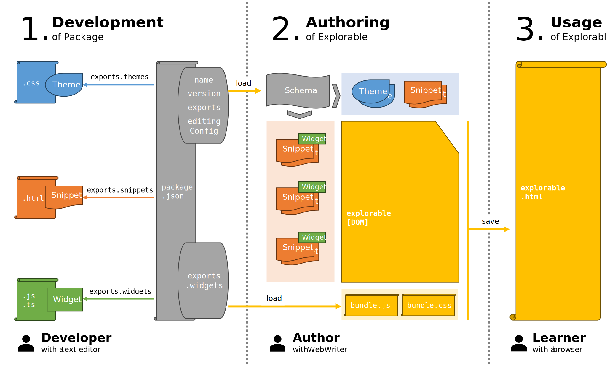

# Documentation
This documentation provides instructions on how to extend WebWriter. It is intended only for developers. If you just want to use WebWriter, try the *Get Started* button above.

WebWriter is a system for creating explorables, the next generation of digital worksheets. It can be extended with widgets, snippets, and themes. Widgets are interactive elements implemented as [Web Components](https://developer.mozilla.org/en-US/docs/Web/API/Web_components). Snippets are small templates insertable into explorables, implemented as fragments of HTML. Themes are styles applied to the whole document, implemented as CSS stylesheets. Widgets, snippets, and themes are distributed as [NPM Packages](https://docs.npmjs.com/about-packages-and-modules).

Widgets can be created with any library that outputs web components. A recommended choice is [Lit](https://lit.dev), which is a lightweight solution that builds on existing web standards as much as possible.

