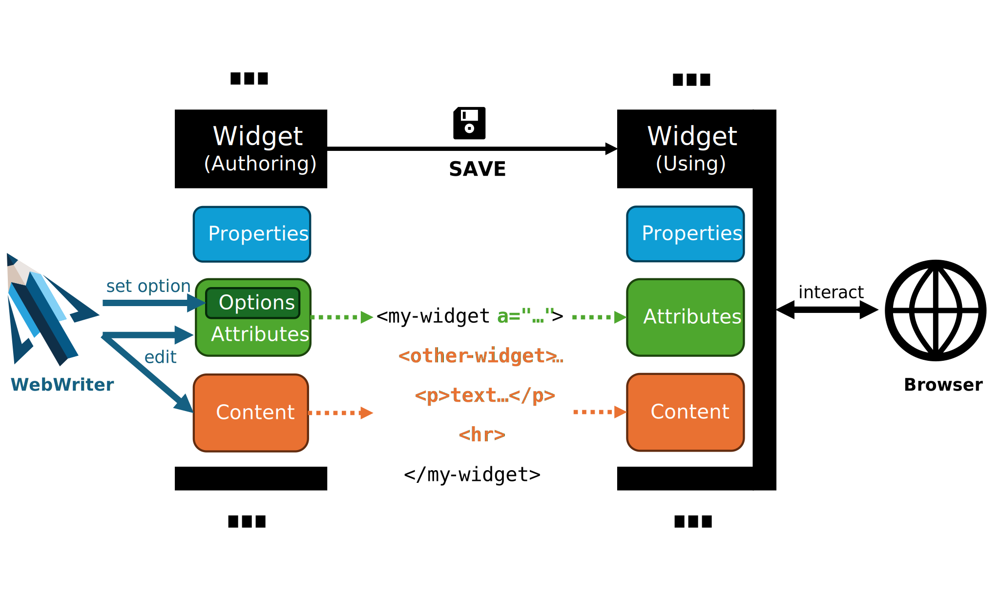

# State
WebWriter offers several ways to organize your widget's state.



## Properties
Object properties can be used to store any kind of data. WebWriter does not persist properties, so they are lost each time an explorable is saved or reloaded.
**A property `showSuggestions`**
```ts
class MyWidget extends LitElementWw {
  showSuggestions = false
}
```


## Attributes
Attributes can be used to store data that can be represented as a string. Attributes are persisted when explorables are saved.

**An attribute `showsuggestions` synchronized with a property `showSuggestions`**
```ts
class MyWidget extends LitElementWw {

  @property({type: Boolean, attribute: true, reflect: true})
  accessor showSuggestions = false
}
```


### Options
You can mark attributes as options. Options are used by WebWriter to auto-generate input fields to modify the corresponding attributes. As the name suggests, this is mostly suited to simple attributes (boolean, string, etc.).

#### Adding static options

**Using the `options` property on the widget class/constructor**
```ts
class MyWidget extends LitElementWw {

  static options = {
    showSuggestions: {type: "boolean", label: {en: "Show suggestions"}}
  }

  @property({type: Boolean, attribute: true, reflect: true})
  accessor showSuggestions = false
}
```

**Using the `@option` decorator on a widget property**
```ts
class MyWidget extends LitElementWw {

  @property({type: Boolean, attribute: true, reflect: true})
  @option({type: Boolean, label: {en: "Show suggestions"}})
  accessor showSuggestions = false
}
```

#### Adding dynamic options 

**Adding an `options` getter on the widget instance**
```ts
class MyWidget extends LitElementWw {

  @property({type: Boolean, attribute: true, reflect: true})
  accessor hasSuggestions = false

  @property({type: Boolean, attribute: true, reflect: true})
  accessor showSuggestions = false

  get options() {
    return !this.hasSuggestions? {}: {
      showSuggestions: {type: "boolean", label: {en: "Show suggestions"}}
    }
  }
}
```

## Content
Content isn't directly part of the widget, but it can interacted with using the Slot API.