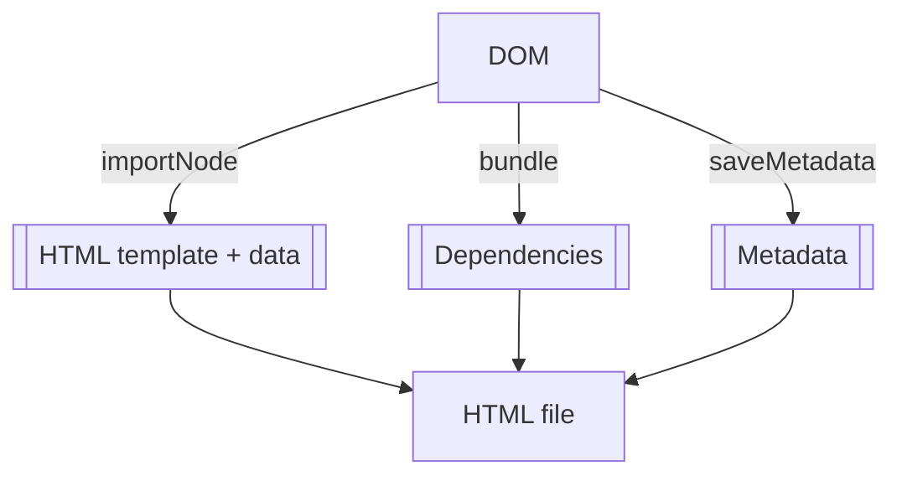
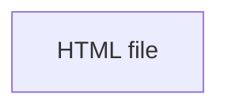

# WebWriter
Authoring tool for digital learning resources called Open Explorables. Open Explorables are...
- **web based**, built with client-side web standards and deployable on the web
- **file oriented**, available as all-in-one, standalone, offline-capable files
- **open**, conformant with OER principles allowing easy reuse
- **multimedial**, combining many media types such as text, audio, video, etc.
- **interactive**, allowing users to interact and receive feedback

## Features
- Author open, interactive and multimedial content: Open Explorables
- Work with an easy-to-use, direct interface, no programming needed (WYSIWYG, "What you see is what you get")
- Get extra packages online and use new widgets in your Open Explorable
- Save your Open Explorable as a single, standalone HTML file (or a SCORM `.zip` file, or a H5P `.h5p` file)
- Provide your Open Explorables to your learners any way you want:
  - It's just a file! Use any cloud storage such as Dropbox, Google Drive, etc. or even use a USB drive
  - It's just a web page! Add it to any LMS (such as Moodle) or any CMS (such as WordPress) or even host it on your own web server

### Supported Platforms
- Windows (.msi: 64bit, ARM64)
- Mac OS (.app: 64bit, ARM64)
- Linux (.deb: 64bit, ARM64)
- Web (Web App) --> optional "WebWriterLite" (limited file and package management)

## Core Ideas
At the core, each open explorable is just a sequence of widgets. Widget types are provided by packages.

| Concept         | DOM representation | Runtime representation | File representation   |
|-----------------|--------------------|------------------------|-----------------------|
| Open Explorable | `HTMLDocument`     | `webwriter.Document`   | `.html`/`.h5p`        |
| Widget          | `HTMLElement`      | `webwriter.Block`      | HTML tag + attributes |
| Package         | -                  | `webwriter.Package`    | npm/yarn package      |

### Open Explorables
At the core, Open Explorables are simply HTML documents. As such, they follow the standard APIs for everything (`HTMLDocument`), including display (DOM) and serialization (saving as HTML). They contain `content`, which is a sequence of zero or more widgets.

### Widgets
Corresponding to Open Explorables, widgets are simply HTML elements, again implementing the same APIs (`HTMLElement`). This means that any element that can be defined in HTML can become a widget, as well. Widgets satisfy this interface (`webwriter.BlockElement`):
1. A string attribute `label`, naming the widget instance
2. A boolean attribute `editing`, where the widget instance provides editing capabilities if `true`
3. A boolean attribute `printable`, where the widget instance provides styles for printing if `true`

### Packages
Packages must follow this interface (`webwriter.Package`):
1. An exported member `element`, satisfying `BlockElement`
2. An exported member `actions`, satisfying `ActionElement[]`
3. (Optional) An exported member type `block`, satisfying `Block`

#### Built-in Packages
The only difference between built-in and all other packages is that built-in packages come pre-installed with the editor. Otherwise, they implement the same interface. 
- Rich text (includes images, audio, video)
- H5P wrapper

### I/O
All widget attributes are persisted, so widget instance state should be stored as attributes.

