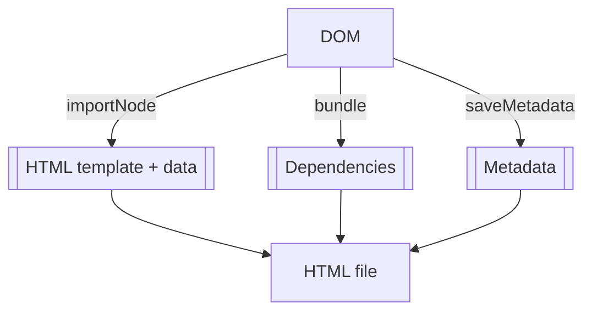
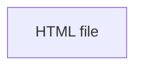

# Explainer: Core ideas
This article summarizes the core technical aspects such as data structures, IO, and so on. It is a helpful introduction to understand WebWriter before extending it with your own widgets.

## Open Explorables
At the core, Open Explorables are simply HTML documents. As such, they follow the standard APIs for everything (`HTMLDocument`), including display (DOM) and serialization (saving as HTML). They contain `content`, which is a sequence of zero or more widgets. Widgets are provided by packages.

| Concept         | DOM representation | Runtime representation              | File representation   |
|-----------------|--------------------|-------------------------------------|-----------------------|
| Open Explorable | `HTMLDocument`     | `webwriter.Document`                | `.html`/`.h5p`        |
| Widget          | `HTMLElement`      | `webwriter.Block`                   | HTML tag + attributes |
| Package         | -                  | `webwriter.BlockElementConstructor` | npm/yarn package      |

## Widgets
Corresponding to Open Explorables, widgets are simply HTML elements, again implementing the same APIs (`HTMLElement`). This means that any element that can be defined in HTML can become a widget, as well. Widgets satisfy the interface `webwriter.BlockElement`.

## Metadata
Both Open Explorables and Widgets may have attached metadata. It is recommended to use a subset of the [schema.org LearningResource type](https://schema.org/LearningResource), but any number of key/value pairs serializable to JSON is permitted. Metadata can be thought of as a cascade:
1. Some metadata is constant for all Open Explorables and Widgets.
2. Other metadata depends on the type of Widget, and is thus defined by the Widget author.
3. Yet other metadata depends on the Widget or Open Explorable instance, and is thus defined by the end user.

*Note: Level 3 of the metadata cascade may be automatically annotated to some degree in the future.* 

## Packages
Packages are npm packages containing a main file that can be bundled by esbuild (JS .js file or TypeScript .ts file). The default export of a package must satisfy the interface `webwriter.BlockElementConstructor`.

### Built-in Packages
The only difference between built-in and all other packages is that built-in packages come pre-installed with the editor. Otherwise, they implement the same interface. 

## I/O
All widget attributes are persisted, so widget instance state should be stored as attributes.

`html` serializer

`zip` serializer (SCORM, H5P)

## Modules of this repository
1. `webwriter`: The authoring tool itself
2. `webwriter-model`: Core types useful for implementing own widgets
3. `webwriter-lit`: Base classes for widget components based on LitElement
